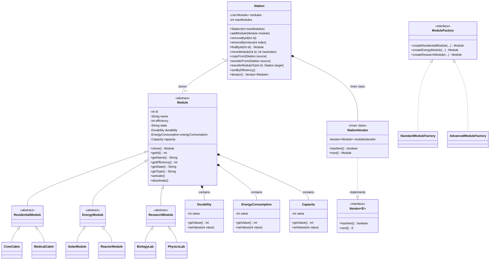

```mermaid
classDiagram
    class Station {
        -List~Module~ modules
        -int maxModules
        +Station(int maxModules)
        +addModule(Module module)
        +removeById(int id)
        +removeByIndex(int index)
        +findById(int id) Module
        +moveModule(int id, int newIndex)
        +copyFrom(Station source)
        +transferFrom(Station source)
        +transferModuleTo(int id, Station target)
        +sortByEfficiency()
        +iterator() Iterator~Module~
    }

    class Module {
        <<abstract>>
        -int id
        -String name
        -int efficiency
        -String state
        -Durability durability
        -EnergyConsumption energyConsumption
        -Capacity capacity
        +clone() Module
        +getId() int
        +getName() String
        +getEfficiency() int
        +getState() String
        +getType() String
        +activate()
        +deactivate()
    }

    class ResidentialModule {
        <<abstract>>
    }

    class EnergyModule {
        <<abstract>>
    }

    class ResearchModule {
        <<abstract>>
    }

    class CrewCabin
    class MedicalCabin
    class SolarModule
    class ReactorModule
    class BiologyLab
    class PhysicsLab

    class Durability {
        -int value
        +getValue() int
        +setValue(int value)
    }

    class EnergyConsumption {
        -int value
        +getValue() int
        +setValue(int value)
    }

    class Capacity {
        -int value
        +getValue() int
        +setValue(int value)
    }

    class ModuleFactory {
        <<interface>>
        +createResidentialModule(...) Module
        +createEnergyModule(...) Module
        +createResearchModule(...) Module
    }

    class StandardModuleFactory
    class AdvancedModuleFactory

    class StationIterator {
        <<inner class>>
        -Iterator~Module~ modulesIterator
        +hasNext() boolean
        +next() Module
    }

    class Iterator~E~ {
        <<interface>>
        +hasNext() boolean
        +next() E
    }

    Module <|-- ResidentialModule
    Module <|-- EnergyModule
    Module <|-- ResearchModule

    ResidentialModule <|-- CrewCabin
    ResidentialModule <|-- MedicalCabin
    EnergyModule <|-- SolarModule
    EnergyModule <|-- ReactorModule
    ResearchModule <|-- BiologyLab
    ResearchModule <|-- PhysicsLab

    ModuleFactory <|.. StandardModuleFactory
    ModuleFactory <|.. AdvancedModuleFactory

    Station "1" o-- "0..*" Module : stores
    Module *-- Durability : contains
    Module *-- EnergyConsumption : contains
    Module *-- Capacity : contains

    Station *-- StationIterator : inner class
    StationIterator ..|> Iterator : implements
```

```
