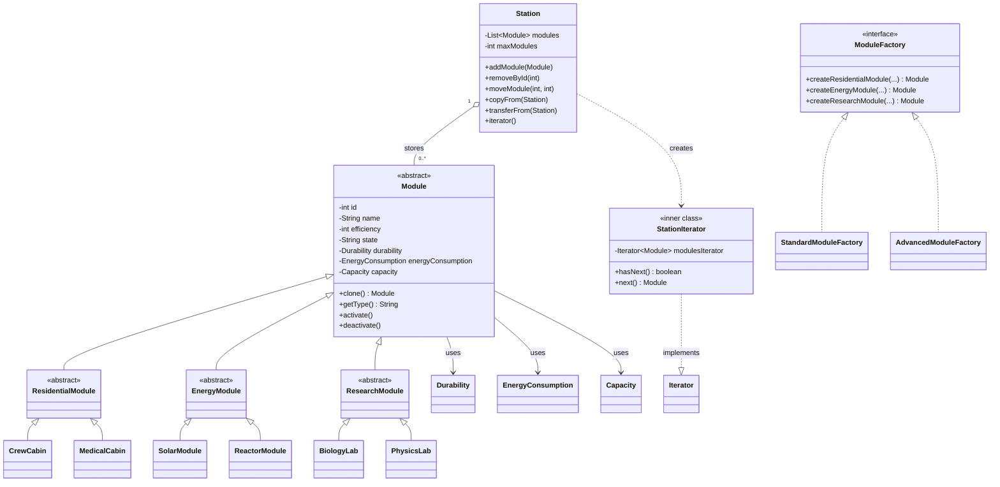

```mermaid
classDiagram
    class Station {
        -List~Module~ modules
        -int maxModules
        +addModule(Module)
        +removeById(int)
        +moveModule(int, int)
        +copyFrom(Station)
        +transferFrom(Station)
        +iterator()
    }

    class Module {
        <<abstract>>
        -int id
        -String name
        -int efficiency
        -String state
        -Durability durability
        -EnergyConsumption energyConsumption
        -Capacity capacity
        +clone() Module
        +getType() String
        +activate()
        +deactivate()
    }

    class ResidentialModule {
        <<abstract>>
    }

    class EnergyModule {
        <<abstract>>
    }

    class ResearchModule {
        <<abstract>>
    }

    class CrewCabin
    class MedicalCabin
    class SolarModule
    class ReactorModule
    class BiologyLab
    class PhysicsLab

    class Durability
    class EnergyConsumption
    class Capacity

    class ModuleFactory {
        <<interface>>
        +createResidentialModule(...) Module
        +createEnergyModule(...) Module
        +createResearchModule(...) Module
    }

    class StandardModuleFactory
    class AdvancedModuleFactory

    class StationIterator {
        <<inner class>>
        -Iterator~Module~ modulesIterator
        +hasNext() boolean
        +next() Module
    }

    Module <|-- ResidentialModule
    Module <|-- EnergyModule
    Module <|-- ResearchModule

    ResidentialModule <|-- CrewCabin
    ResidentialModule <|-- MedicalCabin
    EnergyModule <|-- SolarModule
    EnergyModule <|-- ReactorModule
    ResearchModule <|-- BiologyLab
    ResearchModule <|-- PhysicsLab

    ModuleFactory <|.. StandardModuleFactory
    ModuleFactory <|.. AdvancedModuleFactory

    Station "1" o-- "0..*" Module : stores
    Module --> Durability : uses
    Module --> EnergyConsumption : uses
    Module --> Capacity : uses

    Station ..> StationIterator : creates
    StationIterator ..|> Iterator : implements
```
