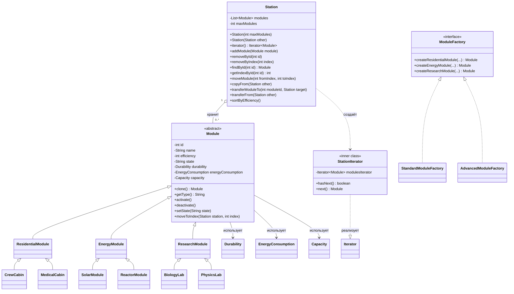

```mermaid
classDiagram
    class Station {
        -List~Module~ modules
        -int maxModules
        +Station(int maxModules)
        +Station(Station other)
        +iterator() Iterator~Module~
        +addModule(Module module)
        +removeById(int id)
        +removeByIndex(int index)
        +findById(int id) Module
        +getIndexById(int id) int
        +moveModule(int fromIndex, int toIndex)
        +copyFrom(Station other)
        +transferModuleTo(int moduleId, Station target)
        +transferFrom(Station other)
        +sortByEfficiency()
    }

    class Module {
        <<abstract>>
        -int id
        -String name
        -int efficiency
        -String state
        -Durability durability
        -EnergyConsumption energyConsumption
        -Capacity capacity
        +clone() Module
        +getType() String
        +activate()
        +deactivate()
        +setState(String state)
        +moveToIndex(Station station, int index)
    }

    class ResidentialModule
    class EnergyModule
    class ResearchModule

    class CrewCabin
    class MedicalCabin
    class SolarModule
    class ReactorModule
    class BiologyLab
    class PhysicsLab

    class Durability
    class EnergyConsumption
    class Capacity

    class ModuleFactory {
        <<interface>>
        +createResidentialModule(...) Module
        +createEnergyModule(...) Module
        +createResearchModule(...) Module
    }

    class StandardModuleFactory
    class AdvancedModuleFactory

    class StationIterator {
        <<inner class>>
        -Iterator~Module~ modulesIterator
        +hasNext() boolean
        +next() Module
    }

    Module <|-- ResidentialModule
    Module <|-- EnergyModule
    Module <|-- ResearchModule

    ResidentialModule <|-- CrewCabin
    ResidentialModule <|-- MedicalCabin
    EnergyModule <|-- SolarModule
    EnergyModule <|-- ReactorModule
    ResearchModule <|-- BiologyLab
    ResearchModule <|-- PhysicsLab

    ModuleFactory <|.. StandardModuleFactory
    ModuleFactory <|.. AdvancedModuleFactory

    Station "1" o-- "0..*" Module : хранит
    Module --> Durability : использует
    Module --> EnergyConsumption : использует
    Module --> Capacity : использует
    Station ..> StationIterator : создаёт
    StationIterator ..|> Iterator : реализует
```
